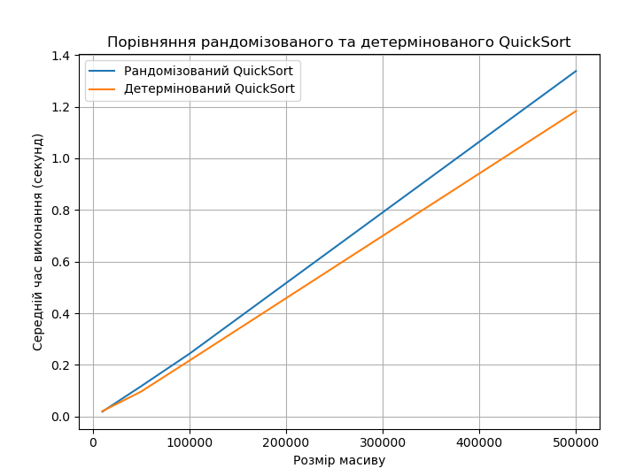

## Завдання 1. Порівняння рандомізованого та детермінованого QuickSort

Хоча рандомізований QuickSort зазвичай гарантує кращу захищеність від гіршого випадку, наприклад, коли масив уже відсортований і ми обираємо крайній елемент як півот, на випадкових даних достатньо вдалий детермінований вибір півота (середній елемент за індексом) поводиться дуже схоже на рандомізований. У цьому випадку детермінований QuickSort показав трохи кращий час за рахунок меншого накладного коду (без викликів `random`).

**Результати вимірювань:**

- **Розмір масиву: 10000**  
  - Рандомізований QuickSort: 0.0188 секунд  
  - Детермінований QuickSort: 0.0208 секунд

- **Розмір масиву: 50000**  
  - Рандомізований QuickSort: 0.1170 секунд  
  - Детермінований QuickSort: 0.0964 секунд

- **Розмір масиву: 100000**  
  - Рандомізований QuickSort: 0.2428 секунд  
  - Детермінований QuickSort: 0.2164 секунд

- **Розмір масиву: 500000**  
  - Рандомізований QuickSort: 1.3383 секунд  
  - Детермінований QuickSort: 1.1830 секунд

---

## Завдання 2. Складання розкладу занять за допомогою жадібного алгоритму

**Розклад занять:**

- **Наталія Шевченко**, 29 років, email: `n.shevchenko@example.com`  
  *Викладає предмети:* Біологія, Хімія

- **Дмитро Бондаренко**, 35 років, email: `d.bondarenko@example.com`  
  *Викладає предмети:* Інформатика, Фізика

- **Олександр Іваненко**, 45 років, email: `o.ivanenko@example.com`  
  *Викладає предмети:* Математика